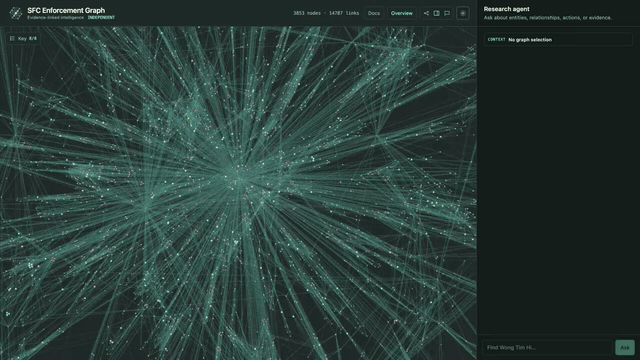

# SFC Enforcement Graph

Independent, evidence-linked exploration of Hong Kong SFC enforcement actions.
Browse the graph directly, ask a grounded research agent, or query the same
validated data through a public read-only API.

<p align="center">
  
</p>

```text
SFC releases → SQLite → typed extraction → graph.json → Graphology analytics
                                                               ↓
                                  graph UI ↔ research agent ↔ REST API
```

## Why it exists

- Keeps every graph claim attached to an exact source release and evidence quote.
- Preserves allegation, finding, conviction, order, and sought-action status.
- Gives the agent bounded search, inspection, expansion, ranking, path,
  neighborhood, component, and community operations.
- Computes degree, PageRank, exact betweenness, k-core, components, and Louvain
  communities over the semantic graph with Graphology.
- Makes every agent-driven graph focus and every visual filter reversible.
- Exposes the complete dataset and graph metrics without model calls or credentials.

Graph proximity and centrality are structural signals, not evidence of misconduct.

## Quickstart

Requires Python 3.12+, [uv](https://docs.astral.sh/uv/), Node.js 22+, and an
Azure OpenAI v1 endpoint and key for extraction and chat.

```bash
uv sync --group dev
npm ci
export AZURE_OPENAI_ENDPOINT=https://RESOURCE.services.ai.azure.com/openai/v1
export AZURE_OPENAI_API_KEY=...
npm run dev
```

Open the graph at `http://localhost:5173` and documentation at
`http://localhost:5173/docs/`.

The included graph is ready to use. Rebuild it from public SFC releases with:

```bash
uv run sfc-graph-sync --full
uv run sfc-graph-extract --full --workers 4
uv run sfc-graph-export
```

Extraction makes model calls. Use `--limit N` before a full run when validating
configuration or cost.

## Public API

```bash
curl http://localhost:8787/api/v1/metrics
curl 'http://localhost:8787/api/v1/search?q=Futu%20Securities&limit=5'
curl -L 'http://localhost:8787/api/v1/graph?download=1' -o graph.json
```

The versioned API supports search, node inspection, bounded neighborhoods,
components, communities, metric rankings, summary metrics, and the complete
JSON download. See the [API reference](docs/api.md).

## Documentation

- [Quickstart](docs/quickstart.md)
- [Using the graph](docs/usage.md)
- [Methodology](docs/methodology.md)
- [API](docs/api.md)
- [Operations](docs/operations.md)

MkDocs builds the same Jade light and Sapphire dark themes used by the app. The
production server exposes the generated site at `/docs/`.

## Architecture

```text
src/sfc_enforcement_graph/  sync, extract, store, export
shared/                     graph contract, analytics, pure queries
server/                     HTTP, public API, and research agent
web/                        React interface
docs/                       source documentation
```

SQLite is the source of truth. `data/graph.json`, graph metrics, documentation,
and browser state are replaceable projections with explicit rebuild paths.

## Verify and deploy

```bash
uv run pytest -q
npm test
npm run lint
npm run build
npm start
```

Railway reads `railway.json`, builds the Vite application and MkDocs site,
starts Hono, and checks `/api/health`. Set `AZURE_OPENAI_ENDPOINT` and
`AZURE_OPENAI_API_KEY`, optionally `AZURE_OPENAI_MODEL` and
`CHAT_REQUESTS_PER_MINUTE`, and a hard provider spend limit.

## Data and scope

The dataset derives from public [SFC enforcement
news](https://apps.sfc.hk/edistributionWeb/gateway/EN/news-and-announcements/news/enforcement-news/).
The original release remains authoritative. This project is independent of the
SFC and is not legal or investment advice.

## License

Copyright (C) 2026 drukpa1455.

The original software and documentation in this repository are available
under either:

- the [GNU Affero General Public License, version 3 or later](LICENSE); or
- a separate [commercial license](COMMERCIAL-LICENSE.md) for proprietary use.

You may choose the AGPL without a commercial agreement if you comply with its
terms. SFC source material, the derived dataset, and third-party dependencies
are not relicensed by this project and remain subject to their respective
rights and terms.
